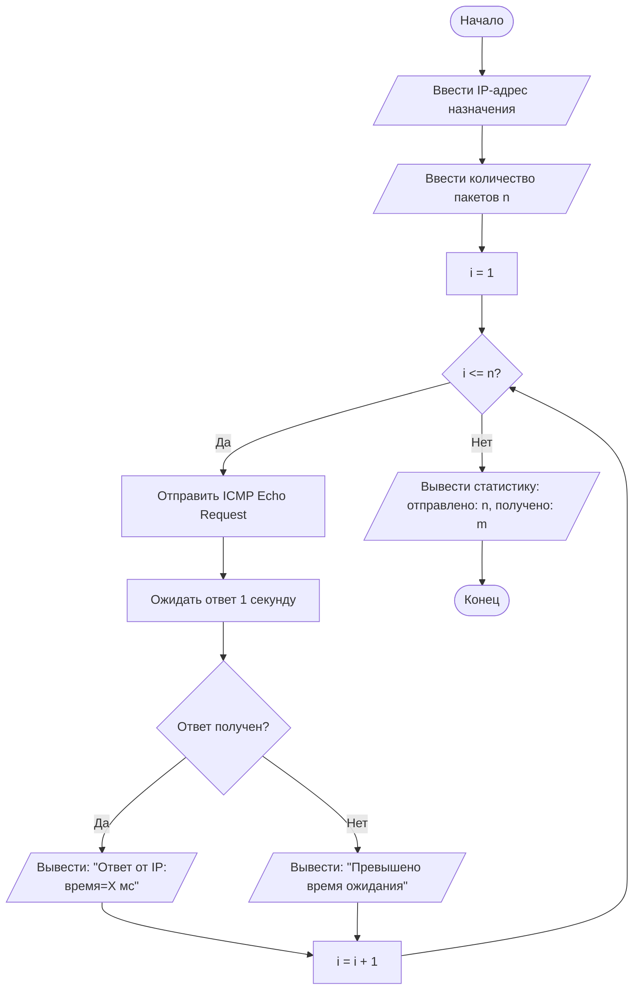
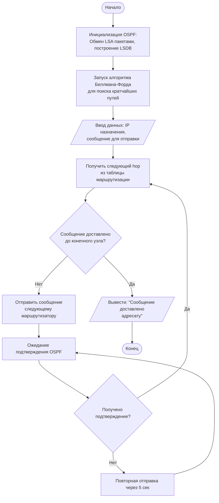
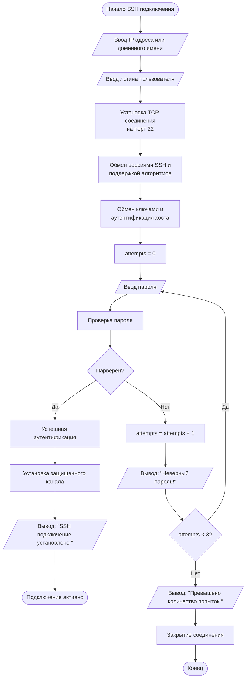
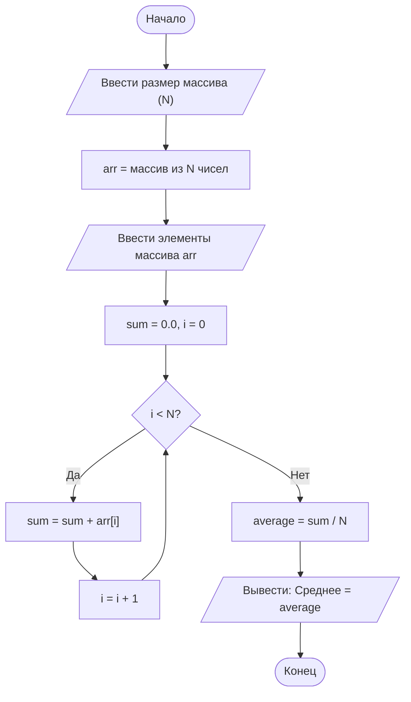

Сделал Павлов Илья 323СА1
### Задание 1

```mermaid
flowchart TD
   
    A([Начало]) --> B[/Ввести IP-адрес назначения/]

    B --> C[/Ввести количество пакетов n/]

    C --> D[i = 1]

    D --> E{i <= n?}

    E -- Да --> F[Отправить ICMP Echo Request]

    F --> G[Ожидать ответ 1 секунду]

    G --> H{Ответ получен?}

    H -- Да --> I[/Вывести: "Ответ от IP:<br>время=X мс"/]

    I --> J[i = i + 1]

    H -- Нет --> K[/Вывести: "Превышено время ожидания"/]

    K --> J

    J --> E

    E -- Нет --> L[/Вывести статистику: <br>отправлено: n, получено: m/]

    L --> M([Конец])
```
   
### Задание 2

```mermaid
flowchart TD

    A([Начало]) --> B[Инициализация OSPF:<br>Обмен LSA пакетами, построение LSDB]

    B --> C[Запуск алгоритма Беллмана-Форда<br>для поиска кратчайших путей]

    C --> D[/Ввод данных: IP назначения,<br>сообщение для отправки/]

    D --> E[Получить следующий hop<br>из таблицы маршрутизации]

    E --> F{Сообщение доставлено<br>до конечного узла?}

    F -- Нет --> G[Отправить сообщение<br>следующему маршрутизатору]

    G --> H[Ожидание подтверждения OSPF]

    H --> I{Получено подтверждение?}

    I -- Да --> E

    I -- Нет --> J[Повторная отправка через 5 сек]

    J --> H

    F -- Да --> K[/Вывести: "Сообщение доставлено<br>адресату"/]

    K --> L([Конец])
```

### Задание 3

```mermaid
flowchart TD

    A([Начало SSH подключения]) --> B[/Ввод IP адреса или доменного имени/]

    B --> C[/Ввод логина пользователя/]

    C --> D[Установка TCP соединения<br>на порт 22]

    D --> E[Обмен версиями SSH и<br>поддержкой алгоритмов]

    E --> F[Обмен ключами и<br>аутентификация хоста]

    F --> G[attempts = 0]

    G --> H[/Ввод пароля/]

    H --> I[Проверка пароля]

    I --> J{Парверен?}

    J -- Да --> K[Успешная аутентификация]

    K --> L[Установка защищенного канала]

    L --> M[/Вывод: "SSH подключение установлено!"/]

    M --> N([Подключение активно])

    J -- Нет --> O[attempts = attempts + 1]

    O --> P[/Вывод: "Неверный пароль!"/]

    P --> Q{attempts < 3?}

    Q -- Да --> H

    Q -- Нет --> R[/Вывод: "Превышено количество попыток!"/]

    R --> S[Закрытие соединения]

    S --> T([Конец])
```

### Задание 4
#### Вариант 8

```mermaid
flowchart TD

    A([Начало]) --> B[/"Ввести размер массива (N)"/]

    B --> C["arr = массив из N чисел"]

    C --> D[/"Ввести элементы массива arr"/]

    D --> E["sum = 0.0, i = 0"]

    E --> F{"i < N?"}

    F -- Да --> G["sum = sum + arr[i]"]

    G --> H["i = i + 1"]

    H --> F

    F -- Нет --> I["average = sum / N"]

    I --> J[/"Вывести: Среднее = " average/]

    J --> K([Конец])
```
